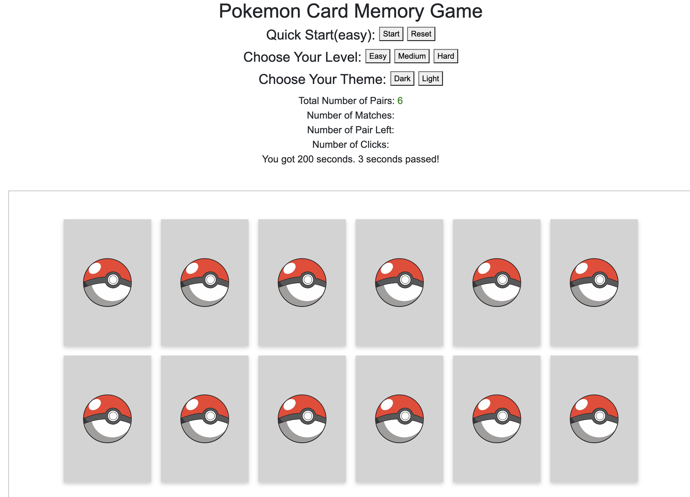
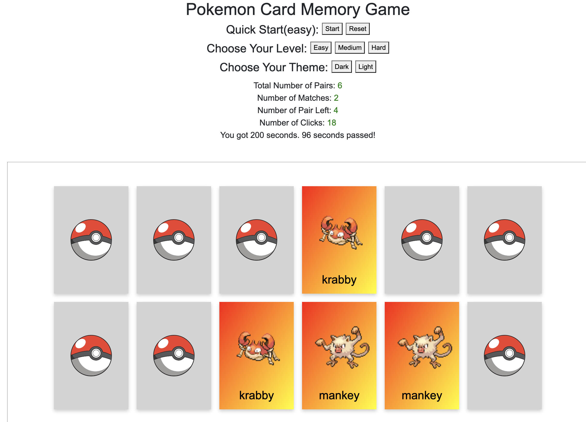
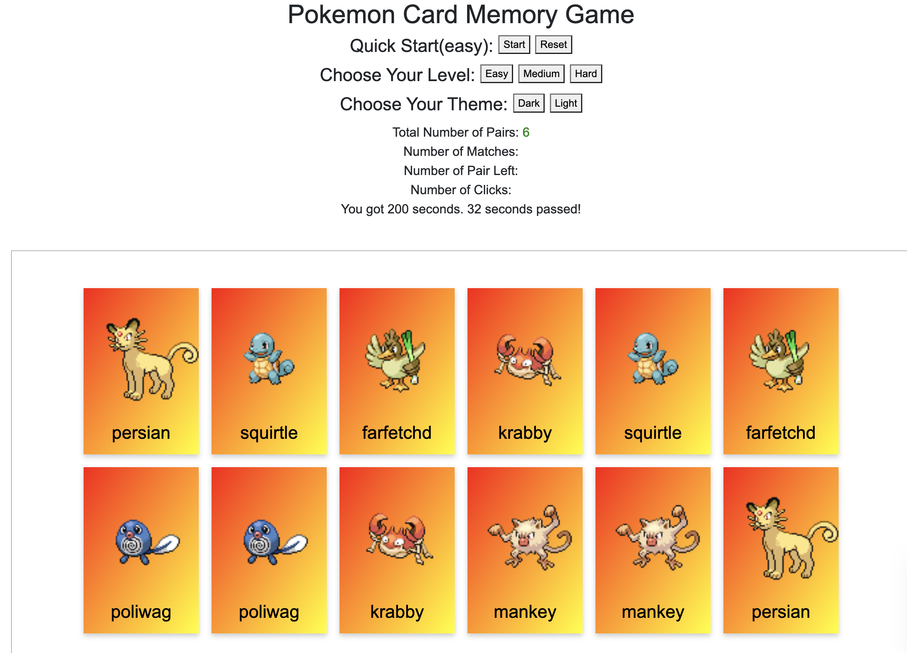

  <h3 align="center">Pokemon Card Memory Game</h3>
  

    This is Pokemon Card Game utilizing HTML5, CSS3, and Javascript, hosted on Netlify
     
     
    <a href="https://snazzy-lamington-7a020d.netlify.app/">See My Game</a>
    ·
    <a href="/">Report Bug</a>
  

